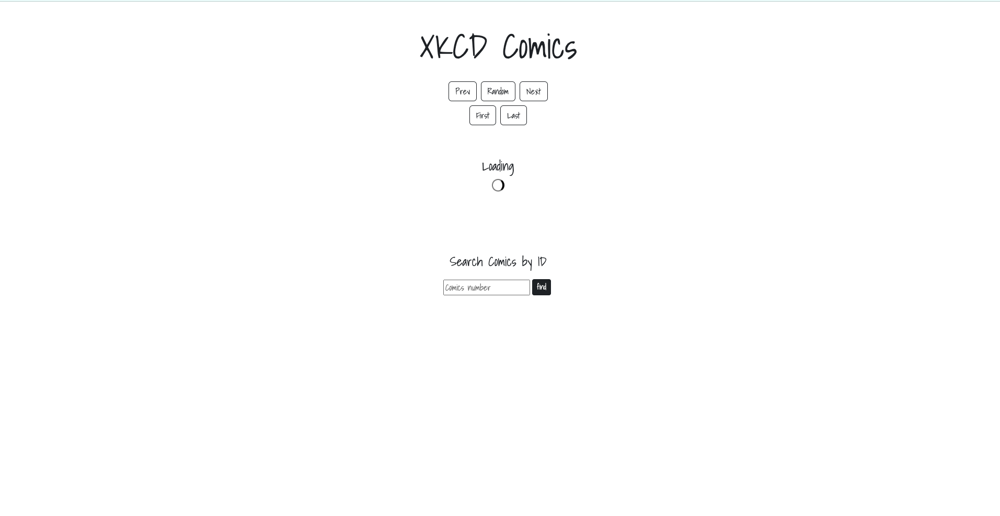
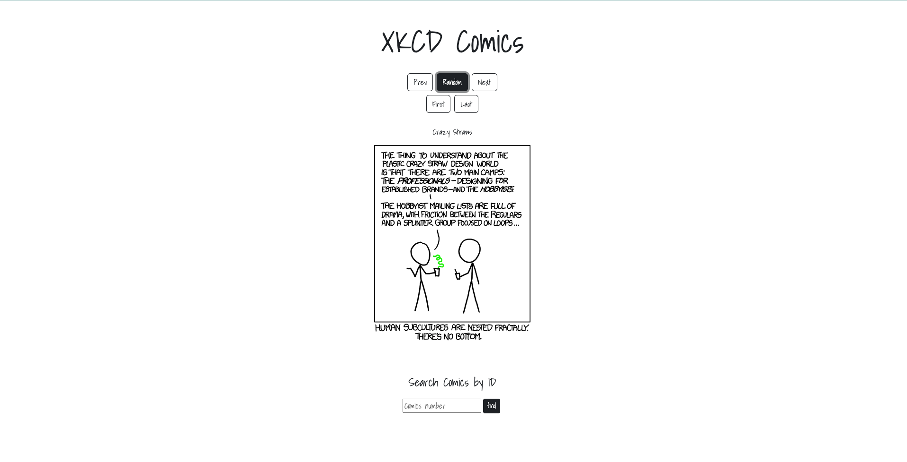

# XKCD Comics application

This project was bootstrapped with [Create React App](https://github.com/facebook/create-react-app).

I created this project within the Global Hack Week: APIs Hackathon. One of the challenges was to build a XKCD Comic app using HTML, CSS and JS with a step-by-step [tutorial](https://theultimateapichallenge.com/xkcd-api), but I wanted to solve this project with my new react skills, so I didn't follow this tutorial. 

XKCD are cool programming comics and have a REST API for them! In the XKCD API Challenge I built a bit more complex UI, with more options for the user. I covered  different scenarios of requests - e.g. request a comic by ID, a random one, next, previous, first and last one existing, - all of that with the help of API calls!
The design was already done by the creators of the Challenge, I sticked with it.

## What did I built?

### The project with the loading screen

### The project with a random comic
